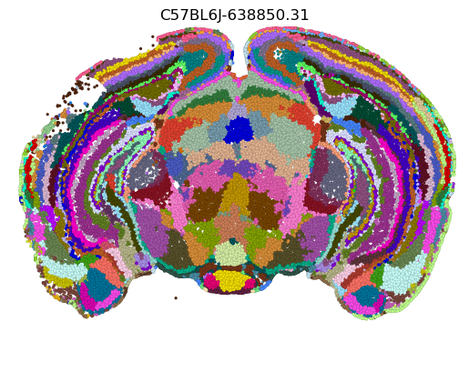
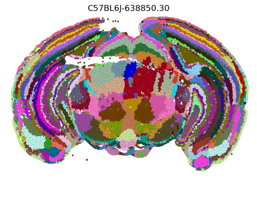

# Contents of Repo
This repo contains several items necessary to reproduce the paper 
"Data-driven fine-grained region discovery in the mouse brain with transformers".

1. the package `brainformr` which is pip installable
	- we also provide a Dockerfile
	- repo has CI/automated testing set up, but right now it is a minimal set and we plan to address this prior to publication
2. `mkdocs` automatic documentation which will be hosted at github.com/abbasilab/celltransformer upon publication
	- to build the docs, pip install `docs/requirements.txt`
	- a PDF-formatted version is found at documentation.pdf in the root of this repository (note that there are various formatting changes that were made in converting the website to a PDF and that we plan to display it as a static site, not a PDF)
	- the items in the documentation include:
		* a walkthrough of how to use the package to train a transformer model using our objective on the AIBS MERFISH data -- configuration is limited to setting paths to the data using `hydra` config files (a brief tutorial is provided), and we provide a minimal example of how to do so
		* descriptions of the model data requirements (ie what attention matrix formats, how the data is passed to the model itself)
		* non-technical descriptions (as well as some code contextualization descriptions) of the dataloader and the format that is output by it, including both single-sample `__getitem__` level logic and logic to collate the single neighborhoods across batches at the PyTorch dataloader level
		* automatic documentation from the code itself assembled as an API reference; critical items (models, loaders) are extensively documented and type-annotated
3. scripts and ipynb files to perform basic analyses 
	- scripts are a minimal `argparse` interface over code to get embeddings from a trained model and dataset and to cluster them using the `cuml` we used in the paper
	- ipynb files principally describing the workflows after the model is generated 
		- again, clustering the data after embeddings and visualization (because the number of clusters can be large, sometimes it is slightly nontrivial to visualize them), ex:
		
		

		- smoothing the embeddings on the spatial graph (see paper)
		- counting the number of different single-cell types (from reference atlas) in a spatial cluster (code can also be used to do so for CCF regions, whatever class labeling etc.)

# Model and data sharing

* all data used in this repository was publicly available from the Allen Brain Cell dataset
* the model weights and the embeddings for the Allen Institute for Brain Science data are available here: https://ucsf.box.com/s/n2h38wlpgqveqnywrpvvjrkdt4o2nd0h
	* we are currently in the process of hosting these on a more permanent solution (S3 or Zenodo), but provide these as initial outputs of our work for review

# Citation

If this is useful to you, please consider citing: 

```
@article {Lee2024.05.05.592608,
	author = {Lee, Alex J. and Yao, Shenqin and Lusk, Nicholas and Ng, Lydia and Kunst, Michael and Zeng, Hongkui and Tasic, Bosiljka and Abbasi-Asl, Reza},
	title = {Data-driven fine-grained region discovery in the mouse brain with transformers},
	elocation-id = {2024.05.05.592608},
	year = {2024},
	doi = {10.1101/2024.05.05.592608},
	publisher = {Cold Spring Harbor Laboratory},
	URL = {https://www.biorxiv.org/content/early/2024/06/13/2024.05.05.592608},
	journal = {bioRxiv}
}
```
