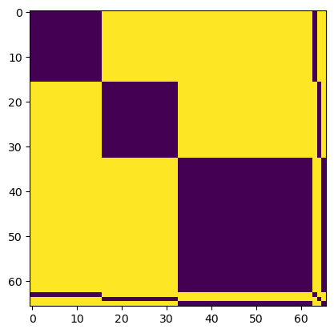
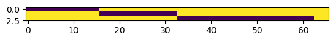
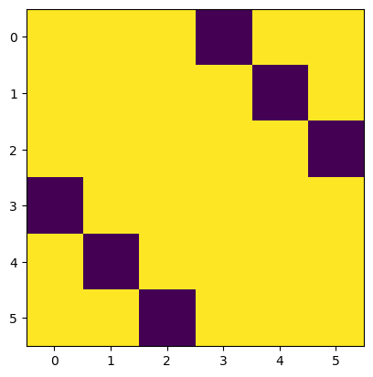

## Formatting data for the model:

The model expects a packed sequence format. Because of the various operations of the network, in practice we need three attention mask matrices.

1. one matrix to mask the encoder 
	* at this stage, the model sees the "observed" cells (not the reference cell) and its various `<cls>`-like tokens
	* we store these in blocks such that the first block of tokens (`n_toks` by `embed_dim`) are all the cells in the different neighborhoods, and the last `n` indices correspond to the <cls>-like tokens. Therefore the attention mask for this stage features blocks in the upper left and then spans in the bottom right that allow the `<cls>`-like tokens to attend to the cell tokens and vice versa.

	Here is an example of this matrix:

	

	In this batch of data we can see that the first 15 or so tokens correspond to the first neighborhood. The next 15-20 are in another neighborhood. Then we have a larger neighborhood which has almost 35-40 cells. 

	The smaller lines allow the neighborhood tokens and the `<cls>`-like tokens to attend to each other. 

2. When we pool the tokens together, we use a different mask:

	

	* since we have three neighborhoods, we have three pooling tokens that are True/1 (or False/0, depending on the coding of the attention matrix masking) in spans corresponding to the neighborhood identity.

3. Finally, we then concatenate these to the decoding tokens corresponding to the reference cells; for this we need a third matrix:

	

	Where you can see the first token (the first pooled neighborhood representation) and the fourth (the decoding token for the first neighborhood) can attend to each other, and vice-versa.

Otherwise the components are all standard `PyTorch`. This is likely not computationally optimal. If possible future iterations of this codebase ought to include more performant versions of the standard transformer operations.
	
